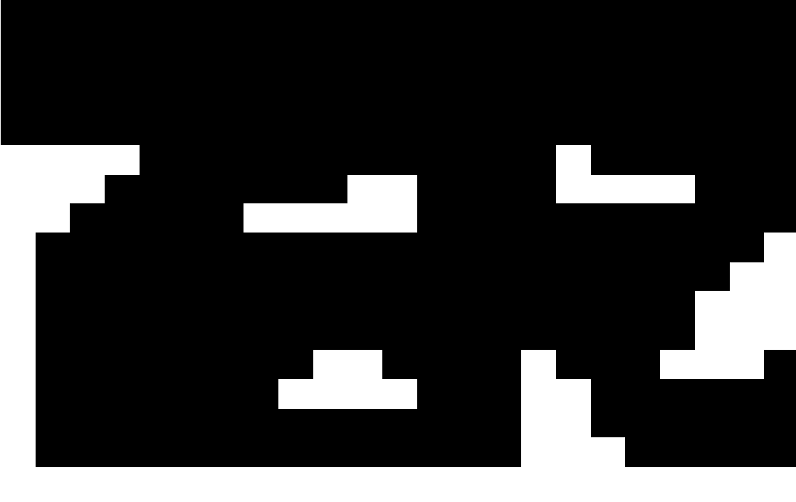

# Deadshot

## Members
1. Napasai 	  Sutthichutipong	6010545811
2. Dechabhol	  Kotheeranurak	6010546664

## Description 
Deadshot is 2D shooting game for 2 players on 1 computer. Players will fight each other by using their own weapons, the last remaining player is the winner of the game. Player can select characters and maps. This game will use projectile motion formula to calculate the path of bullet under the action of gravity. The main factor of the curve path is initial velocity of bullet and angle of reach.

## Main feature 
- Players can select characters and maps
- Calculate projectile motion curve

## Knowledge needed to use
- Javafx
- Threads
- Swing

## Purpose of this project 
- To study multi-threading
- To study Swing

## Map picture

		
		System.out.println(w + " x " + h);
		
		for (int i = 0; i < h; i++) {
			for (int j = 0; j < w; j++) {
				// reference
				// https://stackoverflow.com/questions/25761438/understanding-bufferedimage-getrgb-output-values
				int pixel = image.getRGB(i, j);
				int red = (pixel >> 16) & 0xff;
				int green = (pixel >> 8) & 0xff;
				int blue = (pixel) & 0xff;
				if (red == 255 && green == 255 && blue == 255) {
					addObject(new Block(i * 32, j * 32, 0, ObjectId.Block));
				}
				if (red == 255 && green == 106 && blue == 0) {
					addObject(new Block(i * 32, j * 32, 1, ObjectId.Block1));
				}
				if (red == 64 && green == 64 && blue == 64) {
					addObject(new Block(i * 32, j * 32, 3, ObjectId.Block2));
				}
				if (red == 255 && green == 0 && blue == 0) {
					addObject(new Block(i * 32, j * 32, 2, ObjectId.BlockLava));
				}
			
			}
		
		}
	
	
  
  Block diffecrentiate by pixel's color. 
